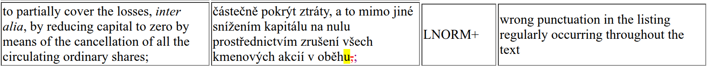

# DGT 2025: Error Span Annotation project
Materials for the ESA MT project @ DGT workshop 2025.

## Project goal

Find the best setup for applying LLMs to **annotating translation errors** on the level of error spans.

## Our data
The data we will work with are documents from various domains. The source documents are (mostly) in English, translations are into various languages.

Currently, we have the following data available (to be updated):

#### (1) Data samples from DGT (CONFIDENTIAL):

**Domain**: legal documents.

Samples from the documents translated by a subcontractor and then evaluated in DGT. 



**Error categories:**

- **Terminology** (minor/major)
- **Linguistic norm** (minor/major)
- **Job-specific style** (minor/major)
- **General style** (minor/major)
- **Design** (minor/major)

#### (2) Data from WMT24 (public):

**Domains**: books, news, social networks

Data from the [WMT24 shared task](https://www2.statmt.org/wmt24/). Documents were collected by shared task organizers, translated by various systems (LLM-based), and annotated by human annotators.

> 

**Error categories**: Minor, Major.


## Our experiments

Inspired by [Kocmi et al. (2024)](https://aclanthology.org/2024.wmt-1.131/) and [Kasner et al. (2025)](https://arxiv.org/abs/2504.08697), we will use LLMs to automate finding errors in translated texts.

### How to (not) go about that?

The naive approach would be to fire up the web interface of any LLM-based service, paste the source document and its translation into the chat window, and ask the model to *"check whether there are any translation errors"*. 

However, such an approach would lead to results that are too diverse and prompt sensitive. Crucially, it would not be possible to **automate and evaluate** such an approach.

### Better approach: Error span annotation

To make the results more consistent, we will formalize the task as error span annotation (ESA):


In ESA, we have the following (for each error):
- character index of the **start and end** of the error span,
- span **error category**,
- (optionally) **explanation** of the error.

To make sure that we can automatically parse the LLM output, we will constrain its output to a list of annotations in the JSON format:

```json
{
  "annotations": [
    { 
      "reason": "[REASON]",
      "text": "[TEXT_SPAN]",
      "annotation_type": "[CATEGORY_INDEX]",
      "occurence_index": "[OCCURRENCE_INDEX]"
    },
    ...
  ]
}
```
where:

- `REASON` is the explanation of the annotation,
- `TEXT_SPAN` is the textual content of the annotated span,
- `CATEGORY_INDEX` is a number from the list of annotation categories,
- `OCCURRENCE_INDEX` is a 0-based index for disambiguating multiple occurrences of the same text.

> [!WARNING]  
> We will **not** ask LLMs for the start/end character indices of the span. As the model does not have access to these indices, it would resort to guessing. Instead, we generate the textual content of the span (→LLMs are ok-ish at *copying* text) and find it in the source text during postprocessing.

### What can we experiment with?

| Area                    | Goal                                                                                                                         | What to experiment with                                                          | Expectations (=what have we observed so far)                                                                                                                                                                             |
| ----------------------- | ---------------------------------------------------------------------------------------------------------------------------- | -------------------------------------------------------------------------------- | ------------------------------------------------------------------------------------------------------------------------------------------------------------------------------------------------------------------------ |
| **Models**              | Find a model which can perform ESA robustly across domains and languages.                                                    | Try different models (out of the available ones - see below)                     | Smaller open LLMs often struggle even with the format of the output itself, while larger LLMs can provide actionable outputs.                                                                                            |
| **Error categories**    | Find a set of error categories that the LLMs can handle and are useful for later processing.                                 | Try to change the number of error categories and their descriptions.             | LLMs can handle any various number of categories, as long as they are described precisely.                                                                                                                               |
| **Text chunk size**     | Find the length of the text segments that give the best results.                                                             | Try to change the size of text segments we evaluate.                             | LLMs tend to provide a constant number of annotations per output → that means they overannotate shorter chunks and underannotate longer chunks.                                                                          |
| **Prompt instructions** | Investigate whether the LLM outputs are robust to how we formulate the prompt.                                               | Try to reformulate the prompt.                                                   | There are *critical* and *less critical* parts of the prompt. What needs to be described precisely are (1) the error categories and (2) the output format.                                                               |
| **Error explanations**  | Investigate whether model explanations are accurate and whether asking for them tends to improve results.                    | Manually analyze model explanations, try to enable / disable the `reason` field. | Asking for an explanation is akin to the "chain-of-thought" prompting, which can improve the results, but not necessarily. Also the explanations themselves are accurate only in some cases.                             |
| **Evaluation**          | Investigate how to evaluate the annotations produced by the model (either with reference human annotation or referenceless). | Try various metrics for evaluating the results.                                  | There are multiple ways to evaluate ESA, none of which are perfect. F1-score weighed by the length of the overlap tends to perform the best. Finding a good metric for evaluating error explanations is an open problem. |

## Our framework
Constraining LLM outputs, preparing the prompts, visualizing the outputs, and evaluating the annotations can be a lot of work.

To make our lives easier, we will use [factgenie](https://github.com/ufal/factgenie): an annotation and visualizaiton tool we prepared exactly for this purpose.

<div style="border:1px solid #ccc; padding:10px; display:block; margin: auto;">
    
</div>


### Factgenie instance

You will use the factgenie instance we have prepared specifically for this project:

1) Go to https://quest.ms.mff.cuni.cz/nlg/dgt-workshop/
2) Log in:
    - **user**: `dgt`
    - **password**: `dgtworkshop25`

The instance contains data and configuration files for you to start with.

Before starting any experiments, please, make yourselves familiar with the **project usage guide**: 👉️ https://github.com/ufal/factgenie/wiki.


Also, please attend to any last-minute instructions. I am ready to assist you with managing the data and experimental results.
